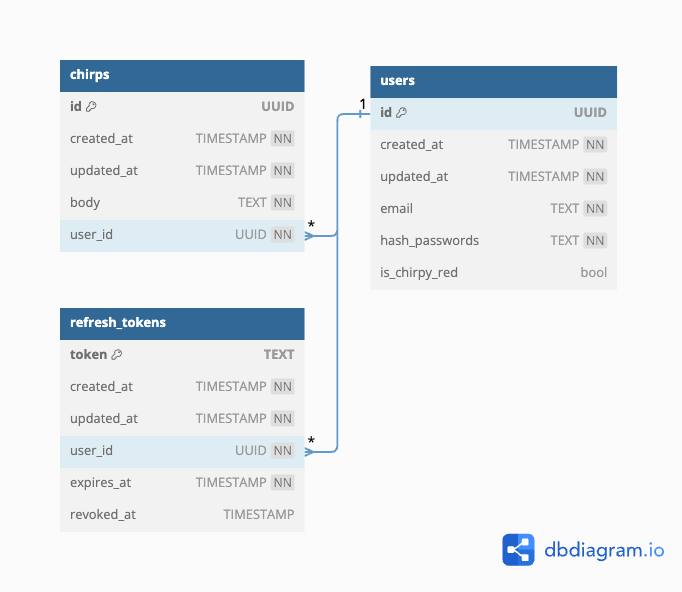

# Twitter backend clone - Chirp
Guided project in Golang from boot.dev


## Contents
1. [API endpoints](#1-api-endpoints)
	- [User Endpoints](#user-endpoints)
		- [Create user account](#create-user-account)
		- [Login](#login)
		- [Update login information](#update-login-information)
		- [Post chirp](#post-chirp)
		- [Get all chirps](#get-all-chirps)
		- [Get chirp by ID](#get-chirp-by-id)
		- [Delete chirp by ID](#delete-chirp-by-chirp-id)
	- [Third party integration](#third-party-integration)
	- [Readiness endpoint](#readiness-endpoint) 
2. [Code walkthrough](#2-code-walkthrough)
	- [Database](#database)
		- [Schema](#schema)
	- [Http request multiplexer](#http-request-multiplexer)
	- [Http server struct](#http-server-struct)
	- [Adding handlers](#adding-a-handler)
	- [Custom handlers](#custom-handler)
	- [Custom handler function wrapper](#custom-handler-function-wrapper)

## 1. API endpoints
#### User Endpoints

| HTTP Method | Resource URL            | Purpose                           | Query Param                                           | Auth endpoint? |
| ----------- | ----------------------- | --------------------------------- | ----------------------------------------------------- | -------------- |
| POST        | `/api/users`            | Create user account               | -                                                     | -              |
| POST        | `/api/login`            | Login user                        | -                                                     | -              |
| PUT         | `/api/users`            | Update login information          | -                                                     | Y              |
| POST        | `/api/chirps`           | Post chirps                       | -                                                     | Y              |
| GET         | `/api/chirps`           | Get all chirps                    | "author_id": {chirp_author_id}<br>"sort": asc or desc | -              |
| GET         | `/api/chirps/{chirpID}` | Get specific chirp by chirp ID    | -                                                     | -              |
| DELETE      | `/api/chirps/{chirpID}` | Delete specific chirp by chirp ID | -                                                     | Y              |

##### Create user account
Creates and stores user account in the database. Requires `email`, `password`.

Method and endpoint: `POST /api/users`

Request Body:
```json
{
	"email": "example@email.com",
	"passowrd": "password123"
}
```

Response `200` payload:
```JSON
{
	"User": {
				"id": "${user_id}",
				"created_at": "${creation datetime}",
				"updated_at": "${last updated datetime}",
				"email": "example@email.com",
				"is_chirpy_red": "${user.is_chirpy_read}"
			}
}
```

##### Login
Login user with `email` and `password`

Method and Endpoint: `POST /api/login`

Request Body:
```JSON
{
	"email": "example@email.com",
	"passowrd": "password123"
}
```

Response `200` payload:
```JSON
{
	"User": {
				"id": "${user_id}",
				"created_at": "${creation datetime}",
				"updated_at": "${last updated datetime}",
				"email": "example@email.com",
				"is_chirpy_red": "${user.is_chirpy_read}"
			},
	"token": "${access_token}",
	"refresh_token": "${refresh_token}"
}
```

##### Update login information
Update existing user's email and password, requires user to have been authorized.

Method and Endpoint: `PUT /api/users`

Request header:
```http
Authorization: Bearer ${access_token}
```

Request Body:
```JSON
{
	"email": "example@email.com",
	"passowrd": "password123"
}
```

Response `200` payload:
```JSON
{
	"User": {
				"id": "${user_id}",
				"created_at": "${creation datetime}",
				"updated_at": "${last updated datetime}",
				"email": "example@email.com",
				"is_chirpy_red": "${user.is_chirpy_read}"
			}
}
```

##### Post chirp
Permits authorized user to post chirp with max character length of 140 with banned words censored.

Method and endpoint: `POST /api/chirps`

Request header:
```http
Authorization: Bearer ${access_token}
```

Request Body:
```json
{
	"body": "${chirp}"
}
```

Response `201` payload:
```json
{
	"Chirp":{
				"id": "${chirp_id}",
				"created_at": "${chirp created datetime}",
				"updated_at": "${chirp last updated datetime}",
				"body": "${cleaned chirp body}",
				"user_id": "${chirp author id}"
			}
}
```


##### Get all chirps
Retrieves all chirps in ascending order by creation date. Optional query parameters can be provided as filter.

Method end endpoint: `GET /api/chirps`

Response `200` payload:
```json
[
	{
		"id": "${chirp_id}",
		"created_at": "${chirp creation datetime}",
		"updated_at": "${chirp last updated datetime}",
		"body": "${chirp_body}",
		"user_id": "${chirp author id}"
	},
	...

]
```

Optional query params:

| Query param | Purpose                                        |
| ----------- | ---------------------------------------------- |
| author_id   | Filters chirps by author_id                    |
| sort        | asc: ascending order<br>desc: descending order |

##### Get Chirp by ID
Retrieve specific chirp by ID supplied in path ID.

Method and endpoint: `GET /api/chirps/{chirpID}`

Response `200` payload:
```json
{
	"id": "${chirp_id}",
	"created_at": "${chirp creation datetime}",
	"updated_at": "${chirp last updated datetime}",
	"body": "${chirp_body}",
	"user_id": "${chirp author id}"
}
```

##### Delete chirp by chirp ID
Delete authorized author's chirp by id provided in the path.

Method and endpoint: `DELETE /api/chirp/{chirpID}`

Request header:
```http
Authorization: Bearer ${access_token}
```

Response `204` if successfully deleted.


#### Third party integration
Webhook for fictitious third party payment provider - Polka. 

| HTTP Method | Resource URL          | Purpose                                     |
| ----------- | --------------------- | ------------------------------------------- |
| POST        | `/api/polka/webhooks` | Receives user upgrade status for Chirpy Red |

Request header:
```http
Authorization: Bearer ${api_key}
```

Request Body:
```json
{
	"event": "user.upgrade",
	"data": {
				"user_id": "${user_id}"
			}
}
```

Response `204` if successfully upgraded and reflected in database.

#### Readiness endpoint

| HTTP Method | Resource URL   | Purpose                |
| ----------- | -------------- | ---------------------- |
| GET         | `/api/healthz` | API readiness endpoint |


## 2. Code walkthrough
### Database
PostgreSQL v15, goose migration and SQLC for type-safe code generation.

#### Schema




### Http request Multiplexer
We need a way to differentiate and tell which handler gets assigned to specific http requests. A http request multiplexer (mux) is used to route incoming http requests to specific handlers based on the URL path. 

We will then create our handlers, routes and register them to our mux.

`mux := http.NewServerMux()`

### Http server struct
In Golang, we provide the http server struct an address port as well as a handler - our mux. Here's an example of an empty server, with no routes or handlers registered with our mux.

```go
func main(){
	const port = "8080"
	mux := http.NewServerMux()
	srv := &http.Server{
		Addr: ":" + port,
		Handler: mux,
	}
	srv.ListenAndServe()
}
```

#### Adding a handler
Assuming we are building a fileserver and have a homepage titled `index.html` in the root directory, we use the `.Handle()` method of mux to add a handler to the root path (`/`). We will use a standard `http.Fileserver` as the handler.

```go
func main(){
	const port = "8080"
	const filepathroot = "."
	mux := http.NewServerMux()

	// Specify upon landing at root path, http.FileServer will handle
	// serving contents of file system rooted at root.
	// As a special case, returned file server redirects any request
	// ending in "/index.html" to the same path without specifying
	// "index.html"
	mux.Handle("/", http.FileServer(http.Dir(filepathroot)))
	srv := &http.Server{
		Addr: ":" + port,
		Handler: mux,
	}
	srv.ListenAndServe()
}
```
#### Custom handler
The `http.Handler` is an interface:
```go
type Handler interface {
	ServeHTTP(ResponseWriter, *Request)
}
```
Therefore, any type that implements the `ServeHTTP` method or a function that matches that signature is an `http.Handler`.

Let's implement a handler for the endpoint `/healthz` through a function `handlerReadiness`. We will also use the `/app/` path instead of `/` to serve our `index.html`.

In the `http.ResponseWriter` interface, we will specify the header key-value pair, the http status and the body.

```go
func handlerReadiness(w http.ResponseWriter, req *http.Request) {

	if req.URL.Path != "/healthz" {
		http.NotFound(w, req)
		return
	}
	w.Header().Add("Content-Type", "text/plain; charset=utf-8")
	w.WriteHeader(http.StatusOK)
	w.Write([]byte("OK"))
}

  

func main() {

	const port = "8080"
	const filepathroot = "."
	
	mux := http.NewServeMux()
	mux.Handle("/app/", http.StripPrefix("/app", http.FileServer(http.Dir(filepathroot))))
	
	mux.HandleFunc("/healthz", handlerReadiness)
	srv := &http.Server{
		Addr: ":" + port,
		Handler: mux,
	}
	
	log.Printf("Serving on port: %s\n", port)
	
	srv.ListenAndServe()
}
```

#### Custom handler function wrapper
Supposed we want to keep track of of the number of hits for each landing on our `/app` endpoint:
* We need a way to increment such a variable in an asynchronous manner safely.
* We need a way to call the increment method each time the handler for the specific route is called.

##### Safe increment
Besides `Mutex` lock and unlock, there are `atomic` types that support such operations safely.

```go
type apiConfig struct {
	fileserverHits atomic.Int32
}

func main(){
	apiCfg = &apiConfig{
		fileserverHits: atomic.Int32{},
	}
	apiCfg.Add(1)
}
```

##### Wrapping safe increment in HandlerFunc inside middleware
We can embed the increment method inside a wrapper that our `apiConfig` implements - this wrapper wraps the specific handler which we are interested in tracking. Since we know `http.Handler` is an interface, we can define a function of the same signature and return it. Inside this function, we will make use of the wrapped handler's `serveHTTP` method. We then wrap this function with `http.HandlerFunc`.

Note: we could use `http.HandleFunc` but we will need to pass in the route. In the spirit of DRY code, we can simply wrap it with `http.HandlerFunc`.

```go
type apiConfig struct {
	fileserverHits atomic.Int32
}

func (cfg *apiConfig) middlewareMetricsInc (next http.Handler) http.Handler {
		return http.HandlerFunc(func(w http.ResponseWriter, r *http.Request) {

	cfg.fileserverHits.Add(1)
	next.ServeHTTP(w, r)

	})
}

func main(){
	apiCfg := &apiConfig{
		fileserverHits: atomic.Int32{},
	}
	
	mux := http.NewServeMux()
	
	mux.Handle("/app/", apiCfg.middlewareMetricsInc(http.StripPrefix("/app", http.FileServer(http.Dir(filepathroot)))))
}
```

### Routing and restricting methods on endpoints
In the standard library, we can specify method access on the endpoint in the format `[METHOD] [HOST]/[PATH]`. When a request is made to the endpoints with an unspecified method, the server handles it with a `405` response code (method not allowed).

```go

func main(){

	const port = "8080"
	const filepathroot = "." 
	
	apiCfg := &apiConfig{
		fileserverHits: atomic.Int32{},
	}
	
	mux := http.NewServeMux()
	
	mux.Handle("/app/", apiCfg.middlewareMetricsInc(http.StripPrefix("/app", http.FileServer(http.Dir(filepathroot)))))
	
	// restrict access only for specific methods
	mux.HandleFunc("GET /healthz", handlerReadiness)
	mux.HandleFunc("GET /metrics", apiCfg.handlerMetrics)
	mux.HandleFunc("POST /reset", apiCfg.handlerReset)
}
```

